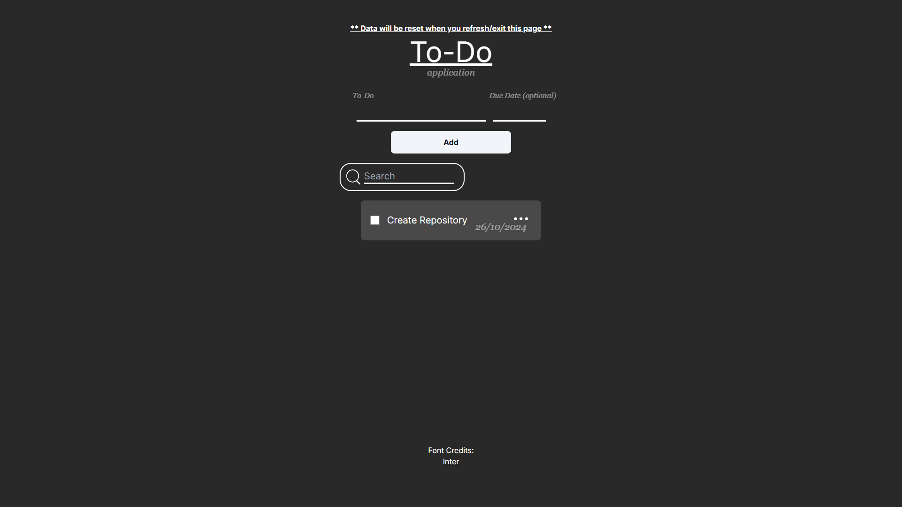
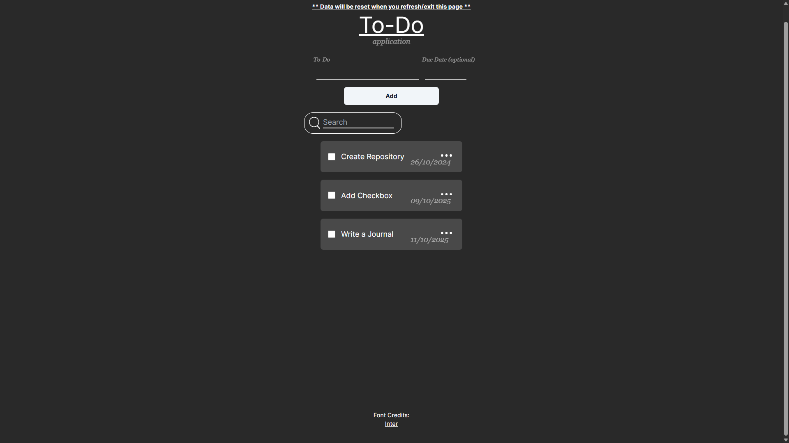

# To-Do Application

To-Do Application created using [Next.js](https://nextjs.org/), [Tailwind CSS](https://tailwindcss.com/) and [TypeScript](https://www.typescriptlang.org/) for web development and [Inkscape](https://inkscape.org/) for creating some icons in this web application

## Screenshots
<br />


## Installation

Download [Node.js](https://nodejs.org/en) and follow this tutorial:

1. Download project
2. <code>cd</code> in to project directory
3. Type these command

```
npm install
npm run dev
```

4. Open <code>localhost:3000</code> in your browser
